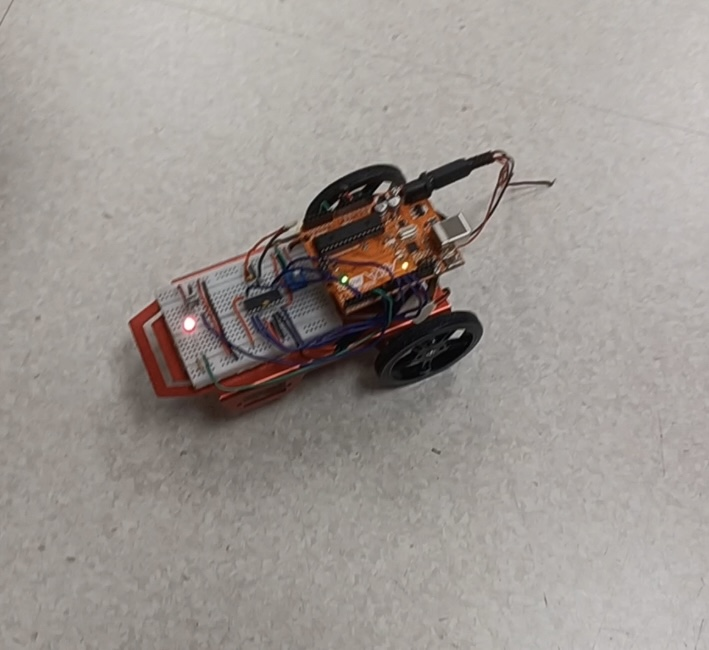

# Arduino RC Car

This project is a remote-controlled car built using an Arduino Uno, L298N motor driver, and an IR receiver module. It allows directional control using an IR remote and operates smoothly over different surfaces.

## Features

- Controlled via IR remote (supports forward, reverse, left, right)
- Stable motion over varied terrain
- Modular and beginner-friendly circuit

## Components Used

- Arduino Uno
- L298N Motor Driver
- IR Receiver (TSOP1738 or similar)
- DC Motors + Wheels
- Car Chassis
- 9V Battery + Holder
- Jumper Wires

## Circuit Diagram


## Images



## Code

The Arduino code is available in the [`code/`](code/) directory. It uses the `IRremote` library for decoding remote signals.

## Getting Started

1. Clone this repo:
   ```bash
   git clone https://github.com/your-username/arduino-rc-car.git